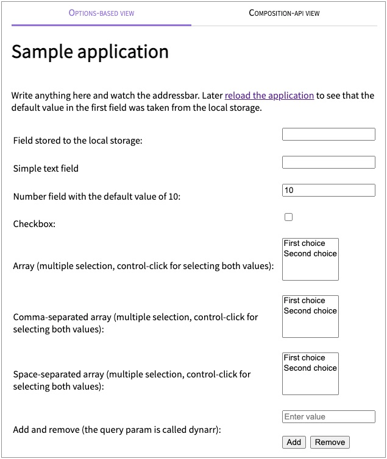

# @oarepo/vue-query-synchronizer

In browser applications, address bar should be the most important source
of truth. When user performs data filtering, sorting, pagination, the url should
change so that the result of the filtering is bookmarkable/shareable.

Traditionally vue component would listen on query change and copy the
query params to an internal model. This would be then used by an input
component. Whenever the input is changed, an event listener (after optional
debouncing) would propagate the change back to the query.

This library does all of this on the background, leaving you with just
a couple of lines of code.

## Installation
```
yarn add @oarepo/vue-query-synchronizer
```

## Usage

### Plugin installation

Add the following to ``main.js`` (in quasar ``boot/....js``)

```javascript
import QuerySupport from '@oarepo/vue-query-synchronizer'

Vue.use(QuerySupport, {
    router: router
})
```
See [src/main.js](src/main.js) for the whole file.

### Router configuration

In router configuration, mark which query parameters should be synchronized
with the component state:

```javascript
import { query } from '@oarepo/vue-query-synchronizer'

const routes = [
{
    path: '/',
    name: 'home',
    props: query(['filter', 'sort']),
    component: Home
}
]
```
Full example at [src/router.js](src/router.js)

### Component

In component, do not forget to add ``query`` to component's ``props``. Then
you can use ``query.filter``, ``query.sort`` as normal models for
html inputs or as models for any other components:

```vue
<template>
<div>
    <input v-model="query.filter"><br><br>
    <pre>{{query}}</pre>
</div>
</template>

<script>
export default {
    name: 'home',
    props: {
        query: Object,
    }
}
</script>
```
Full example at [src/Home.vue](src/Home.vue)

## Demo setup and run
```
yarn install
yarn run serve
```

### Screenshot



## Library build
```
yarn run build
```

## API

### ``QuerySupport`` plugin configuration

During plugin registration, ``router`` must be passed in. Optionally
a global ``debounce`` can be set, the default if unset is 100ms. 
 

```javascript
import QuerySupport from '@oarepo/vue-query-synchronizer'

Vue.use(QuerySupport, {
    router: router,
    debounce: 100,
    datatypes: {
        name: handler
    },
    debug: false
})
```

Setting ``debug`` to ``true`` will log the parsed and serialized query parameters. 

### ``query(paramsList, extraParams?)``

#### ``paramsList``

``paramsList`` is a list of query parameters that should be captured
by the library and synchronized with the component. A member of the list
can be:

   * plain string with the name of the query parameter (as seen in the example above) 

   * parameter name prefixed with a datatype (``number:page``)
   
   * parameter name prefixed with a datatype and followed by a default value
     (``number:page:1``)
     
   * any of the above prefixed by debounce period in ms: (``500:search``,
     ``500:number:amount``, ``0:bool:is_public``, ``500:number:page:1``)
     
   * an object:

```javascript
{
    name: 'search',
    debounce: 1000,
    datatype: 'string',
    defaultValue: null
}
``` 
If the object defines ``debounce`` property, it will be used instead of the default
value.

The object can define a datatype, which is implicitly string. The datatype
defines how the value from URL is converted to model and vice versa. Datatypes
are pluggable, see ``Datatype`` section later in the readme for details. 

If ``default`` is set and a value is not present in the URL, the model
is set to this value. URL is not changed. When a default value is 
programmatically set on the parameter (for example, user enters it in input),
the parameter is removed from the url.  

#### ``extraParams``

Optional parameter ``extraParams`` contains any extra params 
that you would normally put directly under ``props``.
The parameter can be either an object or a function taking ``route`` and 
returning an object.

### ``Datatype``

A datatype provides means to convert url parameter into an internal model
value and vice versa. The pre-installed datatypes are:
   * string - a no-op converter
   * number - converts string value of the number in url into a javascript number
   * bool - if the parameter is present (with whatever value), returns true else false
   * array - returns an array of string (for parameters with multiple values)
   
A custom datatype can be implemented as follows:

```javascript

Vue.use(QuerySupport, {
    router: router,
    datatypes: {
        lowecase: {
            parse(value, defaultValue, parsingDefaultValue) {
                // value is: undefined if property is not present in the url
                // null if property is in url but without a value
                // string value if property is written as url?key=value
 
                // note: defaultValue has been parsed previously so that
                // it already is in the javascript format

                // this method is called once to parse all default values,
                // in this run parsingDefaultValue is set to true
                // so that the datatype might react differently
                return value ? value.toLowerCase() : defaultValue 
            },
            serialize (value, defaultValue) {
                // this method must return undefined, null or string instance
                // returning undefined will remove the property from query
                if (value === defaultValue) { return undefined }
                // returning null will put url?key without a value to the url
                if (value === '') { return null }
                // will put url?key=value into the url
                return value.toLowerCase()
            }
        }
    }
})

```

Default datatypes are implemented by importable ``StringDatatype``, 
``NumberDatatype``, ``BoolDatatype``, ``ArrayDatatype``.

You can use them to create composite datatypes, for example an array
of numbers.

```javascript
ArrayOfNumbersDatatype = {
    parse(value, defaultValue, parsingDefaultValue) {
        if (parsingDefaultValue) {
            return ArrayDatatype.parse(value, defaultValue, parsingDefaultValue)
        }
        return ArrayDatatype.parse(value, defaultValue).
            map(x=>NumberDatatype.parse(x, null))
    },
    serialize (value, defaultValue) {
        return ArrayDatatype.serialize(
            value.map(x => NumberDataType.serialize(value, null)),
            defaultValue)
    }
}
```
